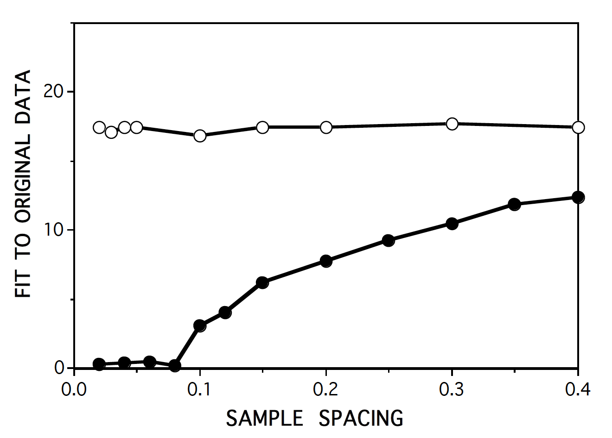
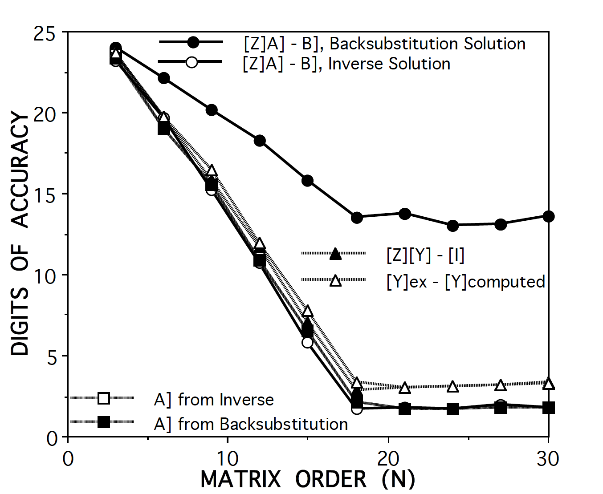
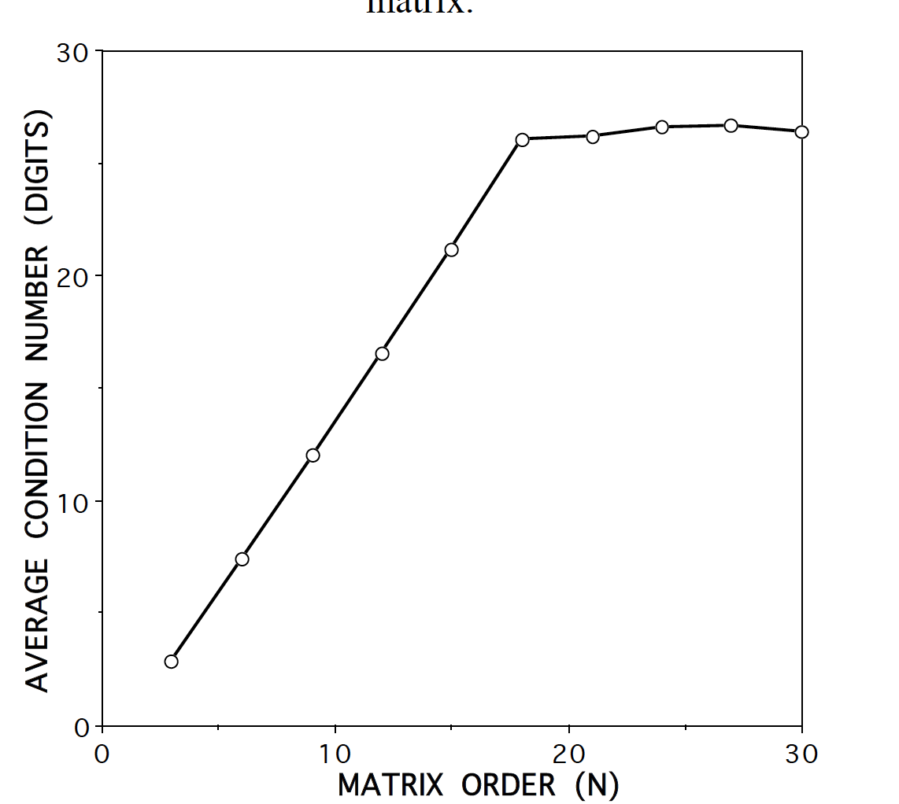
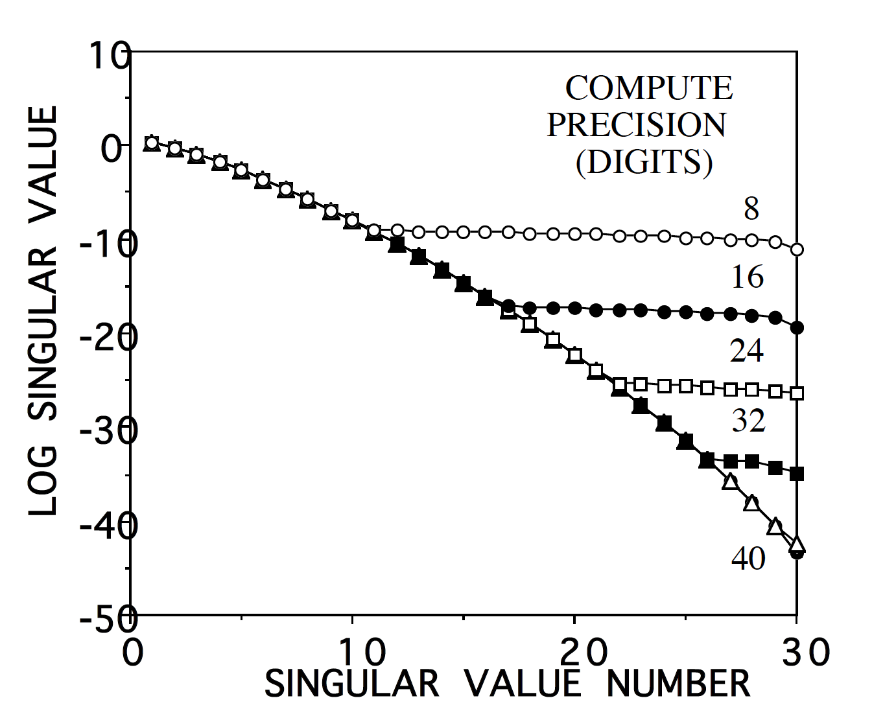

# A COMPARISON OF SOLUTION ACCURACY RESULTING FROM FACTORING AND INVERTING ILL-CONDITIONED MATRICES

#### Edmund K. Miller

### ABSTRACT

The residual vector R] = [Z]A] - B] where [Z] is a coefficient matrix, A] is a vector of unknowns and
B] is a right-hand side vector, is often used as a measure of solution error when solving linear
systems of the kind that arise in computational electromagnetics. Residual errors are of particular
interest in using iterative solutions where they are instrumental in determining the next trial answer
in a sequence of iterates. As demonstrated here, when a matrix is ill-conditioned, the residual
may imply the solution is more accurate than is actually the case.

## MATRIX CONDITION NUMBER AND SOLUTION ACCURACY

In previous related work [Miller (1995)] a study was described that investigated the behavior of
ill-conditioned matrices having the goal of numerically characterizing their information content. One
numerical result from that study was that the solution accuracy (SA) is related to the coefficient ac-
curacy (CA) and condition number (CN), all expressed in digits, approximately as SA ≤ CA -
CN. This conclusion was based on using, as one measure of SA, a comparison of [Z][Y] with [I],
where [Z] is a matrix under study, [Y] is its computed inverse and [I] is the identity matrix.

CNs can generally be expected to grow with increasing matrix size, even for one as benign as
having all coefficients being random numbers. For some matrices, the Hilbert matrix for example,

one of those studied, the CN can grow much faster, being of order 10 1.5N, for a matrix of size
NxN. A large matrix CN was encountered in later work that involved model-based parameter
estimation (MBPE) for adaptive sampling and estimation of a transfer function [Miller (1996)] us-
ing rational functions as fitting models (FM). For example, when using simple LU decomposition
to solve even a low-order system, say one having fewer than 20 coefficients, the CN might ex-

ceed 106. (Note that this problem can be circumvented by using a more robust solution, such as
singular-value decomposition, but that’s also left for a later discussion.) An interesting aspect of
these large CNs was that the match of the FM with the original data when computed using coeffi-
cients obtained from [Y]xB], with B] the right-hand-side vector, could be much less accurate than
when using coefficients instead obtained from back substitution.


## SOME NUMERICAL RESULTS

A typical result that demonstrates this behavior is shown in Fig. 1. The specific situation illustrated
is the match between the original data and the FM (using a numerator polynomial of order n = 7
and denominator polynomial order of d = 6) as the sample spacing is varied. A fit of 10 digits is

equivalent to a residual error of 10 -10. A large difference can be seen between the fit obtained
using coefficients from an inverse operation compared with using those obtained from back sub-
stitution. Note that the poles in the spectrum used for this experiment are spaced one unit apart.
The improvement in the inverse result as the data spacing increases towards a Nyquist-like inter-
val of 0.5 occurs because the CN of the data matrix decreases.

Some additional computer experiments were conducted to explore this behavior, with the re-
sults of one shown in Fig. 2, where several accuracy (or, conversely, error measures) are shown
as a function of matrix order for a Hilbert matrix. The quantities plotted in Fig. 2 are:

```
A]ex - A]bs and A]ex - A]inv,
[Z]A]bs - B] and [Z]A]inv - B],
[Y]ex - [Y]comp,
[Z][Y]comp - [I]
```
where “bs” and “inv” refer to a solution vector obtained using back substitution or inversion, and
“ex” and “comp” refer to an exact analytical or computed inverse matrix, respectively. Results
shown were developed using a single right-hand side having all unit entries. The various accu-
racy results are derived by computing an RMS difference between their respective vectors or
matrices.

Although a different problem from that illustrated in Fig. 1, the residuals are qualitatively similar in
exhibiting a back-substitution accuracy that is consistently higher than that from the inverse solu-
tion. Interestingly, of the six results displayed all are in substantial agreement except for the
back-substitution residual. At about N = 18 and beyond, all reach a noise floor. For the former
five, this implies, considering a compute precision of 24 is being used, a CN ≥ 24, which is not

inconsistent with 10 1.5x18 = 1027. However, the noise floor for the back-substitution residual
remains at about 13 digits, the explanation for which is not obvious. Perhaps most interesting is
that A]bs and A]inv exhibit comparable accuracies in spite of the great differences displayed by

their residuals. In other words, A]bs is not as accurate as might be inferred from its residual.

As an explanation for the declining accuracy exhibited in Fig. 2, the result of averaging some of
the more-often used CNs is plotted in Fig. 3, where it can be seen that a ceiling of about the
compute precision is reached. A different way to look at the CN is to plot the singular-value
spectrum of a matrix as is done for the Hilbert matrix in Fig. 4. In this case, N = 30 and compute
precisions ranging from 8, 16, 24, 32 and 40 are used. In each case, the dynamic range of the
spectrum approximately equals the compute precision, and provides another measure of the
condition number.

### CONCLUDING COMMENTS
To return to the original problem that motivated this discussion, it’s not clear why there is such a
difference between the different residuals shown in Figs. 1 and 2. My particular reason for exam-
ining these results is the implication they may have when using residuals in determining the con-
vergence of an iterative solution. It seems reasonable, if the residual error is smaller than the ac-
tual error in an iterated sequence of solution estimates, to conclude that relying on the residuals as
an indicator of solution accuracy could be misleading. Of course, it must be noted that the differ-
ence between the two error measures appears to be dependent on the CN of the matrix being
solved. This could be one more reason why, as problems are being modeled using more and
more unknowns, the potential related increase in CN needs to be considered in developing
solution strategies. Also, possibly a different measure of residual error would circumvent or reduce
the effect discussed here.

### REFERENCES

 * E. K. Miller (1995), “A Computational Study of the Effect of Matrix Size and Type, Condition
   Number, Coefficient Accuracy and Computation Precision on Matrix-Solution Accuracy,” IEEE
   AP-S International Symposium, Marriott Hotel, Newport Beach, CA, June 18-23, pp. 1020-
   1023.
 * E. K. Miller (1996), “Using Adaptive Sampling to Minimize the Number of Samples Needed to
   Represent a Transfer Function,” IEEE AP-S International Symposium, Hyatt Regency Hotel,
   Baltimore, MD, July 21-26, pp. 588-591.

### Figures

||
|:---:|
|Figure 1. Fit, in digits, between the data samples used for computing the coefficients of a<br>rational-function model and the model results as a function of normalized sample spacing, with<br>computations done in 24-digit compute precision. Results from model whose coefficients are<br>obtained by back substitution are shown by the open circles and those solved by multiplying<br>the right-hand-side vector using an inverse matrix are shown by the solid circles.|

||
|:---:|
|Figure 2. Various accuracy measures for solution of an NxN Hilbert matrix. The circles show results for the residuals and the squares display the solutions, both obtained for a right-hand side vector having all unit values (in both cases the open symbols represent inverse results and sold symbols the back-substitution results). The open triangles exhibit the result of comparing the computed and exact inverse matrices while the solid triangles compare the product of the original and inverse matrices with the identity matrix.|

||
|:---:|
|Figure 3. The average condition number of a Hilbert matrix exhibits an approximate 10 1.5N behavior as expected. It maximizes at a value of about the compute precision, which is 24 digits for this computation.|

||
|:---:|
|Figure 4. The normalized, singular-value spectrum for a Hilbert matrix of N = 30 with the compute precision a parameter. These results demonstrate the large condition number of a Hilbert matrix while also illustrating effect of compute precision on computations for such a problem.|
